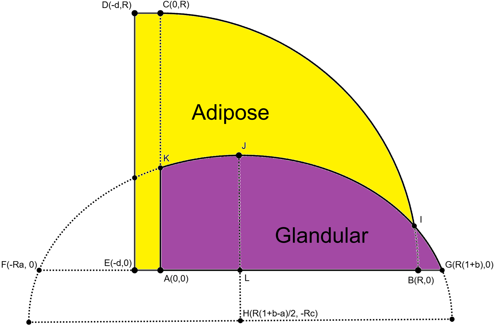

# Early Warning Scan FEM Pipeline

-----

## Table of Contents
1. [Installation](#installation)
    1. [Python package](#python)
2. [FEBio](#febio)
3. [Usage](#usage)
    1. [Getting started](#getting_started)
    2. [Model generation](#model_generation)
    3. [FEM simulation](#fem_simulation)
    4. [Converting to Blender animation](#converting)
    5. [Writing input files](#writing)
4. [Settings](#settings)
    1. [Model](#model)
        1. [Mesh](#mesh)
        2. [Geometry](#geometry)
    2. [Material](#material)
        1. [Skin, adipose & glandular](#skin_adipose_glandular)
        2. [Tumor](#tumor)
    3. [Simulation](#simulation)
        1. [Parabolic jump](#parabolic_jump)
        2. [Curve output](#curve_output)
        3. [Output](#output)

## 1. Installation <a name="installation"></a>

### 1.1 Python package <a name="python"></a>

Here, we provide instructions on how to install the package. We recommend first to make a new environment, though
this is strictly not necessary.

In the event the repro is open access, first clone it from the
[repo](https://bitbucket.org/limebv/ews_fem_pipeline/src/master/) in a folder of your choice. Then within the powershell,
type to the terminal:
```console
pip install .
```
Alternatively, when the python package is sent as a `.zip` file, unzip it at a folder of your choice. Open a powershell, 
navigate to the respective folder and type to the terminal:
```console
pip install .
```
From here, all functionalities of the package should be installed and ready to use.

## 2. FEBio <a name="febio"></a>
For running the FEBio simulations, the package requires FEBio to be available.
This can be obtained by downloading pre-built binaries from the [FEBio website](https://febio.org/), of by building
the sourcecode, which is available on [GitHub](https://github.com/febiosoftware/FEBio); building from source 
requires a C++ compiler, cmake, and preferably MKL.

## 3. Usage <a name="usage"></a>
After installation of the Python package, the pipeline is ready to use. All the direct functionalities of the 
pipeline can be accessed from the terminal. Open any terminal and type `fem-pipeline`. If the installation 
was done successfully, the terminal lists five commands: one command which runs the full pipeline (`run`), three commands which 
represent the separate components of the pipeline (`generate`, `fem` and `convert`), and one command which allows the 
user to make an input file with default settings (`write-default-settings`). Information about the commands can also be
retrieved from the terminal by adding `-h`. For example: `fem-pipeline generate -h`. 

In this section we elaborate on all five commands and provide instructions on how to call them. In subsection 3.1, 
we provide the very basics to run the full pipeline. The other subsections elaborate on the separate commands.

### 3.1 Getting started <a name="getting_started"></a>
The main command within the pipeline is `run` which allows for high through-put data acquisition. The command takes two 
inputs:

- `input_files: tuple(filepaths)`: the path(s) to where the input `.toml` file(s) is/are written. Multiple files 
need to be space separated.
- `-j: int = 0`: controls the parallelization settings. For details on this input, we refer to section 3.3 `fem`.

For the input, the pipeline makes use of `.toml` files, which can easily be accessed and written with a text editor. In
section 3.5, we elaborate on how to write your own input file. For now the user can get started with a [default settings
file](all_default_settings.toml) which we provided in this project. An example command would be:

```commandline
fem-pipeline run path/to/all_default_settings.toml
```

After the simulation has finished, the `run` command generates two output files per `.toml` from which Blender can construct the simulation. To run the 
Blender animation, a number of manual steps need to be taken:

1. Copy the **full** script from `run_animation_in_blender.py` (found at `ews_fem_pipeline/scripts`) and paste it in the
Blender Python API. The API can be found under `Scripting` in the main ribbon. This step only has to be done the very 
first time using it.

2. In the script, set the value for `filepath` equal to the full path of a single `.feb` file. This file is generated in the same folder 
as where the equivalent `.toml` is written. Evidently, only one animation can be run at a time.

3. Run the script by pressing the "play" button at the top of the screen; alternatively use the shortcut `Alt + P`.

4. Navigate to `Layout` in the top ribbon to observe the animation. Optionally set `Rotation = 0 deg` to correctly 
orientate the model. One can change the frame rate under the `Output` side screen to control the animation's play speed.

From here, we will discuss the separate three commands that are contained within `run`. One can also access these commands
separately.

### 3.2 Model generation <a name="model_generation"></a>
 
The `generate` command generates the breast model, the corresponding mesh, as well as all simulation settings
and writes them to the FEBio-compatible input `.feb` file. This command has one input:

- `input_files: tuple(filepaths)` the path(s) to where the input `.toml` file(s) is/are written. Multiple files 
need to be space separated.

All (output) files bare the same name as the name of the `.toml` file. So make sure the name is somehow related to the 
settings or in any other way meaningful.

The code loads the `.toml` file and assigns all settings. Note: only the non-default values need to be provided to the
`.toml` file; all other settings are set to their default value. How to write a `.toml` file and the meaning of the 
different settings will be explained in section 4 "Settings" below. The code outputs a `.feb` file, which is the standard input 
file for FEBio. This will be written in the **same** folder as the `.toml` file.

Finally, the code will also write a `.toml` file, which consist of all settings that ultimately runs the simulation.
This is useful for when you wish to reproduce certain results. This will be written in a subdirectory `/output` of the 
`.toml` file folder with name `all_settings_<filename>.toml`.

### 3.3 FEM simulation <a name="fem_installation"></a>
This command runs one or multiple FEBio simulation(s), depending on the number of input files provided:

- `input_files: tuple(filepaths)`: the path(s) to where the FEBio input `.feb` file(s) is/are written. Multiple files 
need to be space separated.

Optionally, the command allows for parallelization by providing the command with option `-j n`, where `n`
can be `n>1` (external parallelization: running multiple FEBio instances, at max `n` parallel instances), `n=1` (internal
parallelization: allowing FEBio to use multiple threads), and `n=0` (default: parallelization depends on the number of
provided `.toml` files - maximum of four instances.) More information on the `fem` command be found by typing 
`ews-fem-pipeline fem -h` to the terminal.

As an example, three input `.feb` files are run simultaneously with default parallelization by typing in this particular
order:
```commandline
ews-fem-pipeline fem path/to/input_1.feb path/to/input_2.feb path/to/input_3.feb
```
### 3.4 Converting to Blender animation <a name="converting"></a>
This command converts the output files from the FEBio simulation into Blender compatible files. By default, the 
output files, i.e. the `.vtk` files per time step (or optionally the `.xplt`), are printed to the sub-folder `/output` 
of the input file. The command converts the `.vtk` files into a single `.obj` file which contains information on the 
unperturbed mesh, and a single `.npy` file which contains the displacements of all nodes in the mesh at each time step. 
The command takes one argument:

- `filepath`: the path(s) to where the FEBio input `.feb` file(s) is/are written. Multiple files
need to be space separated.

The remains of this part need to be done manually; these instructions are given in section 3.1

### 3.5 Writing input files <a name="writing"></a>
The fifth commands allows the user to write input files with default settings using the command 
`write-default-settings`. The command takes a single input:

- `filepath`: the path to where the input `.toml` is written.

Here, the directory does not need to exist, the code can construct the path for you. This command outputs a `.toml` file 
consisting of all the default settings. In particular, this entails a model with a dense mesh, representative material 
properties and default simulation settings. Currently, running this simulation takes about half an hour.

You can customize your own input file by changing the relevant fields with a text editor. As mentioned in the `generate` section, lines with
default values can be removed, only the non-default must remain. The code will supplement the missing settings with default 
ones. Needless to say, the fields, e.g. `[model.mesh]` or `[material.tumor]`, cannot be removed if one of those settings 
is kept; any other fields may be removed. 

## 4. Settings <a name="settings"></a>
The list of settings is quite extensive and gives the user a lot of control over the breast model and the FEM simulation.
In a `.toml` file, all settings are grouped into one of three fields: `model`, `material` and `simulation`, see 
`all_default_settings.toml` as an example. Now, each field consists of multiple subfields which group different
but related settings. Examples are the mesh (`[model.mesh]`) and the geometry (`[model.geometry]`) which fall under the `model`
field. Under these subfields, settings can be changed by adjusting the number or string behind the equal sign. Note, bools, 
i.e. true and false, should be written with a lower case. In this README, we only discuss the settings that are interesting
for the user to change. These are all listed in a second provided `.toml` file called 
[adjustable_default_settings.toml](adjustable_default_settings.toml). 
All other settings are discussed separately in [detailed_settings.md](/docs/detailed_settings.md). We remind the reader that a `.toml` 
file with default settings can be generated with the instructions from section 3.5.

### 4.1 Model <a name="model"></a>
The model settings contain all settings related to the overall shape of the breast and its meshing properties; material
properties are assigned in a subsequent section. Here we distinguish between the geometry, for the breast's shape, and mesh
for the meshing.

#### 4.1.1 Mesh <a name="mesh"></a>
The meshing contains four parameters, for which one is strictly free to adjust; two other less relevant settings are explained in
[detailed_settings.md](/docs/detailed_settings.md). The default value is given after the equal sign. The adjustable setting is:

- `density: float = 195`: Sets the mesh size. The number is a measure for the 
number of nodes per unit of length; a larger number implies a denser mesh. The default value is sufficiently dense for a
representative animation, while also being fast enough for a trial simulation. Currently, this one takes about half an 
hour. For a quick test, a coarser mesh density of ~100 is advised, which takes about number of minutes. For a very dense 
mesh, we advise a density of ~260, which lasts several hours. ***OPEN ISSUE: for some mesh realizations, some elements 
present anomalies, known as*** *inverted elements* ***which results in a faulty mesh. When this happens, the pipeline 
skips this particular simulation and continues with the correct meshes. The faulty mesh can be averted by picking a 
slightly different mesh density and rerun the `run` command for the faulty cases.***

#### 4.1.2 Geometry <a name="geometry"></a>
To visualize the geometry, we plot a cross-section of the breast in the figure below. The entire breast is made of three
shapes which partially intersect. The overall shape of the breast is 1) a quarter circle centered at point `A(0,0)` and 
passing through `B(R,0)` and `C(0,R)` with `R` the radius; 2) a rectangle of size `d X R` with corner points `A(0,0)`, 
`C(0,R)`, `D(-d,R)` and `E(-d,0)`; 3) an ellipse passing through `H`, `G` and `F`, which is parameterized by `a`, `b`
and `c`. The rectangle acts as a wall which connects the breast to the chest wall. This rectangle is subject to boundary 
conditions which allow the breast to move. The shapes intersect each other at specific points `I`, and `K` (and others 
which are not relevant), which segment the breast into two regions indicted by the coloured regions and enclosed by solid
lines; the dashed lines are only here for construction purposes and are removed afterwards. The purple region is enclosed
by `A`, `L`, `B`, `G` ,`I`, `J` and `K`; the yellow region by `A`, `K`, `J`, `I`, `C`, `D` and `E`. The purple region is
made of glandular tissue, where the protruding section enclosed by `B`, `G` and `I` is the nipple. While the second region
is of adipose type. The 3D model is constructed by revolving the cross-section 360 degrees around the line `EG`. 



In total there are five settings which parameterize the geometry, where four of them are relevant here:

- `radius: float = 0.07 [meters]`: Sets the radius of the breast, all parameters listed here are scaled with the radius. In the figure, `radius` corresponds with `R`. The `radius` should not be set too small, else we run into meshing issues. So typically 0.05 < `radius` < 0.15.
- `left_relative_position_ellipse: float = 0.04 [dimensionless]`: Sets the relative horizontal position of point `F`, left of the chest where the ellipse starts. This point acts as a placeholder for the left side of the ellipse and is removed later. This parameter largely sets the curvature of the ellipse and consequently the ratio of glandular/adipose tissue. In the figure `left_relative_position_ellipse` corresponds with `a`. For values, we advise 0 < `left_relative_position_ellipse` < 0.2.
- `right_relative_position_ellipse: float = 0.05 [dimensionless]`: This parameter sets the position of the nipple, i.e. the relative horizontal position of `G`, scaled with the radius. In the figure `right_relative_position_ellipse` corresponds with `b`. For values, we suggest 0.03 < `right_relative_position_ellipse` < 0.07.
- `center_relative position_ellipse: float = 0.3 [dimensionless]`: Sets the vertical position of `H`, the center point of the ellipse (the horizontal position of `H` is captured by `left_relative_position_ellipse`and `right_relative_position_ellipse`). In particular, increasing this parameter will shift the vertical position of`H` down causing a sharper angle in `G`. We note that setting `center_relative position_ellipse` = 0 turns `G` into right-angled angle, making the nipple a perfect hemisphere. Therefore, we advise 0.05 < `center_relative position_ellipse` < 1.

### 4.2 Material <a name="material"></a>
In this section, we delve into the material settings, which allows for control of the mechanical properties of the 
different tissues within the breast. We split this section in two, where we distinguish between the skin, adipose and 
glandular tissue; and the tumor.

#### 4.2.1 Skin, adipose & glandular <a name="skin_adipose_glandular"></a>
For each non-tumorous tissue: skin, adipose, glandular, we assume the 
[Mooney-Rivlin](https://en.wikipedia.org/wiki/Mooney%E2%80%93Rivlin_solid) material type, which takes three adjustable 
parameters. Each tissue contains the same set of inputs, though of course different settings
can be assigned per tissue. The default settings per tissue are listed in table below.

- `density: float [kg/m^3]`: Sets the mass density.

- `bulk_modulus: float [Pa]`: Sets the bulk modulus in the Mooney-Rivlin material type. 
The `bulk_modulus` is a measure for the material stiffness.
- `coef1: float [Pa]`: Sets the coefficient of the first invariant in the Mooney-Rivlin material type.
- `coef2: float [Pa]`: Sets the coefficient of the second invariant in the Mooney-Rivlin material type.

We stress that more information on the implementation of the Mooney-Rivlin model can be found in the 
[FEBio documentation](https://help.febio.org/docs/FEBioUser-4-7/UM47-4.1.2.9.html). Typical values for the non-tumorous
materials properties are given in the table below. For each value, one can deviate about 30% from the default.

|           | `density` | `bulk_modulus` | `coef1` | `coef2` |
|-----------|-----------|----------------|---------|---------|
| skin      | 1100      | 480000         | 1200    | 1200    |
| adipose   | 911       | 425000         | 109     | 106     |
| glandular | 1041      | 425000         | 230     | 195     |

#### 4.2.2 Tumor <a name="tumor"></a>
The tumor is programmed as a separate entity which can optionally be added to the breast model. Here, it is modelled
as a perfect sphere with a pre-determined radius and position, and material properties depending on where in the breast
the tumor is positioned. Therefore, some Mooney-Rivlin coefficients belonging to the tumor are tissue-dependent. It 
remains an open issue to improve upon the tissue geometry, see `open_issues.toml` within `docs`. The settings are the 
following:

- `tumorous: bool = true`: If true, places a spherical tumor with the below listed 
parameters. If false, no tumor is placed and the code ignores these parameters.
- `density: float = 1079 [kg/m^3]`: Sets the mass density of the tumor.
- `radius: float  = 0.005 [meters]`: Sets the absolute radius [meters] of the spherical 
tumor. NOTE: Does not scale with the `radius` from the geometry settings.
- `position: tuple(float) = (0.035, 0.04, 0) [meters]`: Sets the absolute position (x [m], y [m], z[m]) of 
the tumor in space. Also does not scale with the `radius` from the geometry settings.
- `coef1_adipose: float = 971 [Pa]`: Sets the tumor coefficient of the first invariant 
when inside the adipose part.
- `coef2_adipose: float = 939 [Pa]`: Sets the tumor coefficient of the second invariant 
when inside the adipose part.
- `coef1_glandular: float = 920 [Pa]`: Sets the tumor coefficient of the first invariant 
when inside the glandular part.
- `coef2_glandular: float = 870 [Pa]`: Sets the tumor coefficient of the second invariant 
when inside the glandular part.

These settings are accompanied by a number of remarks which need to be taken in consideration for the user:
- The four tumor Mooney-Rivlin coefficients are assigned to their distinct materials whenever the tumor is (partially) 
placed within that tissue type.
- There are no settings for a 'tumorous skin', therefore the tumor can only be subcutaneous.
- Currently, no checks are implemented that verify whether the tumor is in fact inside the breast. It is up to user to 
pick reasonable values for the position and radius.
- The presence of the tumor is coded by merely assigning different materials properties in space other than those of the
adipose and glandular tissue. In other words, the mesh is ignorant about the tumor. Therefore, a sufficiently small mesh
should be created such that the tumor's intricacies are adequately captured.
- For the tumor's mechanical properties, one can deviate by about 30% from the default values.

### 4.3 Simulation <a name="simulation"></a>
This section discusses the relevant simulation settings in detail. For the less important settings, we again refer to
[detailed_settings.md](/docs/detailed_settings.md). Here we only touch upon the physical settings of the parabolic jump, 
the animation and the output.

### 4.3.1 Parabolic Jump <a name="parabolic_jump"></a>
The field `[simulation.parabolic_jump]` has one setting which is relevant for the user to change. This setting calculates 
the trajectory of the parabolic jump after gravity has set in and writes them to the `.feb` file.
The jump itself is derived from basic mechanics, where we assume a point mass subject to gravity and otherwise without 
friction.

- `max_height : float = 0.01 [meters]`: Sets the maximum height of the parabolic jump in
meters. The initial velocity is calculated from the `max_height`. Be sure not to set this number too large, else the 
solver has trouble with converging. In that case, we advise the user to lower the value for `step_size` (and potentially
`time_steps`) from `[simulation.control_step2]`. 

### 4.3.2 Animation <a name="curve_output"></a>
The field `[simulation.animation]` has one relevant setting, for which it is important that the user knows it exists.
This setting informs FEBio at which specific time steps the output is printed to the `.vtk` files. This is important as
Blender relies on fixed times in-between frames.

- `fps : float = 40 [dimensionless]`: Sets the number of frames per second for the final animation. This number ensures 
that the `.vtk` files are outputted at specific time steps according to the supplied value for `fps`. It is important
that the given value for `fps` in the settings agrees with the fps setting in Blender. By default, it  is set to 40,
in agreement with the EWS camera system. Changing the `fps` will not affect the simulation time.

### 4.3.3 Output <a name="output"></a>
The field `[simulation.output]` gives the user full control over what variables are outputted, and what output types
are desired. We give the settings here:

- `output_to_vtk : bool = true`: If set to true, the simulation outputs a `.vtk` file per time step. The number of `.vtk` 
files is computed by the product of the total simulation time and the number of frames per second:`time_steps` x `step_size` x `fps`; the first two from `[simulation.control_step2]`) and the
latter from `[simulation.curve_output]`. **The pipeline does make further use of all `.vtk` files, so it strongly advised
to set this parameter to true at all times**. If set to false, the simulation outputs all results in a single `.xplt` 
file. This file can only be read by FEBioStudio, therefore this is only useful for visual checks on the results. **The 
pipeline makes no further use of the `.xplt` file, so printing it is strongly discouraged**. Unfortunately, one cannot
make FEBio output both `.xplt` and `.vtk` files in the same simulation.
- `output_displacement : bool = true`: If set to true, the node displacements are written to the `.vtk` per time step (and optionally `.xplt`) file(s).  **The pipeline makes further use of the 
node displacements, so it strongly advised to set this parameter to true at all times**.
- `output_stress : bool = false`: Setting this to true writes the elemental
Cauchy stress to the `.vtk` (or `.xplt`) file(s). This has no further use in the remainder of the pipeline.
- `output_relative_volume : bool = false`: Setting this to true writes the relative 
volume to the `.vtk` (or `.xplt`) file(s). This output is a measure for the increase/decrease in volume of the breast 
with respect  to its original size. This has no further use in the remainder of the pipeline.
