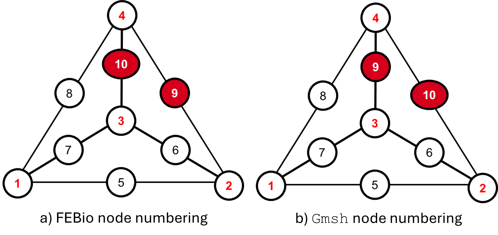

# Remarks
In this document we mention a number of findings that we encountered during the development of this pipeline.
This only becomes important for when the user wants to dig deeply into the code, or be informed about the thought process behind the development.

## Node order assignment
To properly convert the mesh information from `gmsh` to the `.feb` file, the so-called node order needs to be considered.
Effectively, each element in the mesh consists of a number of nodes.
These elements are labeled in a specific order, which allow neighbouring elements to be connected.
Ordering these nodes must be done correctly, else we run into the risk of inverted elements, like we discussed in the [Open issues](open_issues.md#model-improvements-priority).
Important to note here, is that `gmsh` and FEBio have inconsistent node ordering, which implies that some nodes in each element need to be manually adjusted.
Fortunately, this only holds for the second order `tet10` elements.
The nodes that must be adjusted are schematically given in the figure below:
 The red numbers indicate the primary nodes which belong to quadratic tetrahedral elements of order one (`tet4`), the black ones that are added for second order nodes (`tet10`).
The labels with a red background ought to be manually exchanged.
This is readily implemented in the code, see the DocString in `write_elements_to_xml()` in `simulation_setting.py`.

## Node tags order
Another note on the node assignment.
In the `.feb` file, the list of node tags needs to be strictly ascending, else the FEBio simulation crashes.
This is accounted for in `generate_mesh.py` at the very last lines of the function, where the node tags and corresponding coordinates are sorted.

## FEBio outputs
By default, FEBio outputs the data in the form of `.xplt` files, which are binary, and can only be read by FEBio itself.
There exists a number of Python libraries, [febio-python](https://github.com/Nobregaigor/FEBio-Python), [interFEBio](https://github.com/andresutrera/interFEBio/tree/master) and [feb-vtk-converter](https://github.com/yskmt/feb-vtk-converter/blob/master/read_xplt.py), that are developed to read such files, but none of these are regularly maintained or up to date with the latest version which discourages us from using them.
Additionally, we made an effort to create our own version of a FEBio-specific `.xplt` converter, but did not succeed.
Alternately, FEBio outputs the data into `.vtk` files per time step, which can be read by a simple text editor.
Extracting the mesh data can be intuitively done by a Python library [PyVista](https://docs.pyvista.org/api/).
Here, mesh, nodes and element and node displacement data can quite simply be obtained.
The clear downside of this method is that for each time step a separate `.vtk` file is generated, which is undesirable since they need to be fused for the animation.
Within [PyVista](https://docs.pyvista.org/api/), the `.vtk` files can be converted into `.gtlf` files which are compatible with Blender.
Unfortunately, this does not work for two reasons: 1) the result is also a `.gltf` file per time step, which a priori Blender cannot stitch together for an animation, 2) the files still contain the unperturbed meshes – the displacements are not assigned to the mesh as they are regarded as a separate output – so even if the frames would be stitched together, the animation would be motionless.
This was eventually solved by updating the node displacement within the Blender Python API, which we will discuss in the next subsection.
To encompass this, the mesh information of the unperturbed breast at `t=0` is converted from a `.vtk` to a `.obj` file, which only preserves the shell mesh but discards the bulk.
An `.obj` is suitable here, as it can be imported within Blender, which concerns itself with surface meshes anyway.
The displaced nodes are then extracted from each `.vtk` file and saved in a separate `.npy` file per time step.
This method allows for a clear distinction of data types and prevents us from saving the meshes of all time steps, which is less elegant and most notably very memory intensive.

## Blender python API
For the final step, we made use of the Blender Python API, which is built in the Blender program.
This makes use of the `bpy` library, which comes standard with Blender.
In this step, the `.obj` and the `.npy` displacements file are read with the former being converted to a `bpy` object.
Blender makes use of so-called key frames, which can be intuitively understood as a marker of time which stores the value of a property.
Here, we use it to update the nodes’ position for every time step.
The result is an animation which is run within Blender.
